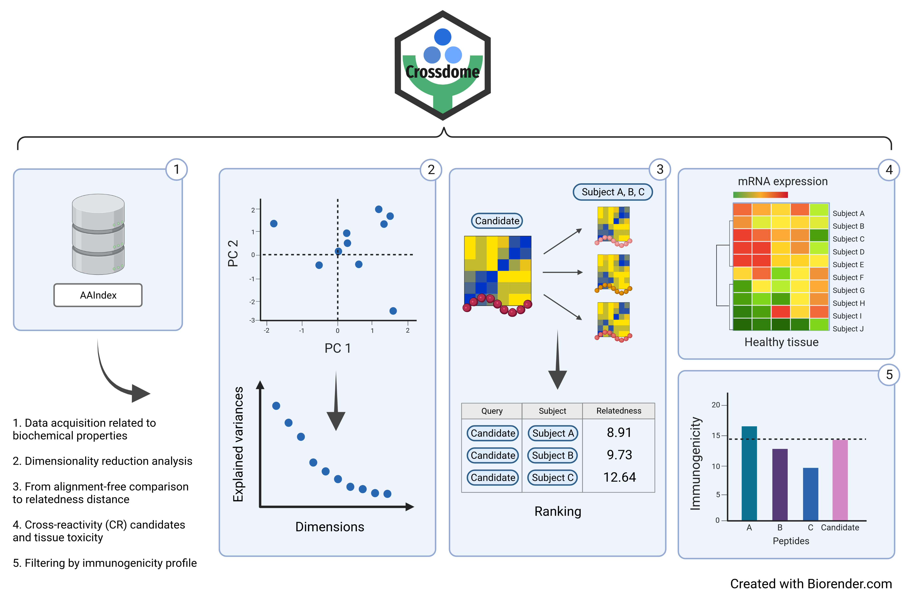

<!-- README.md is generated from README.Rmd. Please edit that file -->

```{r, include = FALSE}
knitr::opts_chunk$set(
  collapse = TRUE,
  comment = "#>",
  fig.path = "man/figures/",
  out.width = "100%"
)

options(tibble.print_min = 5, tibble.print_max = 5)

```

# Crossdome (Beta) <a href=''></a>

<!-- badges: start -->
[](https://github.com/oandrefonseca/crossdome/actions/workflows/R-CMD-check.yaml)
[]()

<!-- badges: end -->

<!--
[]()
[](https://app.codecov.io/gh/oandrefonseca/crossdome?branch=main)
-->

**Developed by:** André Fonseca, PhD <a href='mailto:oandrefonseca@gmail.com'></a>

<br>
<br>

## Installation

```{r, eval = FALSE}

devtools::install_github("antuneslab/crossdome", build_vignettes = TRUE)

```

## Abstract

**Crossdome: An interactive R package to predict cross-reactivity risk using immunopeptidomics databases**

<p align="justify">  
Currently, several clinical protocols are leveraging on distinct immune mechanisms, such as adoptive T-cell therapy and peptide-based vaccines. However, multiple factors can impact the accuracy of these immune-based applications, such as expression heterogeneity, immunogenicity, and cross-reactivity (CR) risk. Crossdome was created to measure cross-reactivity potential based on biochemical properties. Our approach aims to rank potential CR candidates and measure cross-reactivity risk using mRNA expression, immunogenicity score (TCR binding), and MHC presentation probability. Additionally, we provide the expression profile related to each CR candidate.
</p>

<a href=''></a>

<p align="justify">  
<b>Figure 1. Crossdome workflow and strategy.</b> Crossdome summarises biochemical properties per amino acid into 12 principal components. In turn, the principal components are used to convert peptide sequences into biochemical profiles (matrices). Next, given a target peptide, Crossdome screens an immunopeptidomics dataset for a similar biochemical profiler, i.e., CR candidates. A relatedness score between the target and candidate off-targets is calculated based on weighted linear distance. Finally, Crossdome incorporates expression levels and immunogenicity predictions for each potential off-target.
</p>

## Functions and Features

#### Prediction

- **`cross_background`** Peptide database spanning eluted candidates (experimentally validated) and custom (user-defined).
- **`cross_pair_summary`** Calculates relatedness score between peptides.
- **`cross_compose`** Predicts relatedness among peptides in a given database. Low values are associated with cross-reactive candidates.
- **`cross_browser`** Opens an interactive shiny application.

#### Analysis

- **`cross_expression_matrix`**  Extracts gene donor mRNA expression based on CR candidates.
- **`cross_substitution_matrix`**  Calculates position-specific substitution across cross-reactive candidates.
- **`cross_peptide_properties`**  Converts a peptide to biochemical profile.
- **`cross_write`**  Exports Crossdome result slot for a tsv file.

#### Visualization

- **`cross_expression_plot`**  A heatmap presenting the gene donor expression profile.
- **`cross_tissues_plot`**  A bar plot summarizing the tissue-specificy groups.
- **`cross_prediction_plot`**  Plot a dot plot showing the immunogenic predictions **[UNDER CONSTRUCTION]**.
- **`cross_pairwise_plot`**  Correlation plot based on two peptide / biochemical profiles **[UNDER CONSTRUCTION]**.
- **`cross_substitution_plot`**  A heatmap combined with seqlogo displaying amino acid substitutions.

## Documentation

Examples of each function, including code, are available in the package documentation. Please use: `?FUNCTION_NAME`. Additionally, two vignettes are available through the command `browseVignettes('crossdome')`.

## Included datasets

- **`hla_database`** Immunopeptidomics spanning several MHC Class I alleles. Includes binding affinity, and immunogenicity score from [MHC Flurry](https://www.sciencedirect.com/science/article/pii/S2405471220302398) and [DeepImmuno](https://academic.oup.com/bib/article/22/6/bbab160/6261914), respectively.
- **`hpa_database`** Expression database derived from [Human Protein Atlas](https://www.proteinatlas.org/).
- **`peptide_annotation`** Database for mapping peptides to gene-donors derived from [NCBI RefSeq Protein](https://www.ncbi.nlm.nih.gov/refseq/) **[UNDER CONSTRUCTION]**. 
- **`mage_off_targets`** Curated off-targets related to MAGEA3-specific TCR. 

To inspect the data sets use: `data(DATA_NAME)`

## Basic Usage

```{r, message = FALSE}

library(crossdome)

database <- cross_background(off_targets = 'ESDPIVAQY', allele = "HLA-A*01:01")
result <- cross_compose(query = 'EVDPIGHLY', background = database)

```

```{r results = 'hide'}

View(result@result)

```


```{r message = FALSE, echo = FALSE}

library(knitr)
library(kableExtra)
library(dplyr)

to_display_columns <- c('rank', 'query', 'subject',	'n_positive',	'n_mismatch',	'relatedness_score', 'pvalue', 'hla_allele')
to_display_data <- result@result[1:30, to_display_columns] %>%
  mutate(
    relatedness_score = round(relatedness_score, 2),
    hla_allele = sub('\\*', '', hla_allele)
  )

kable(
  to_display_data, 
  row.names = FALSE
)

```

```{r}

str(result)

```
