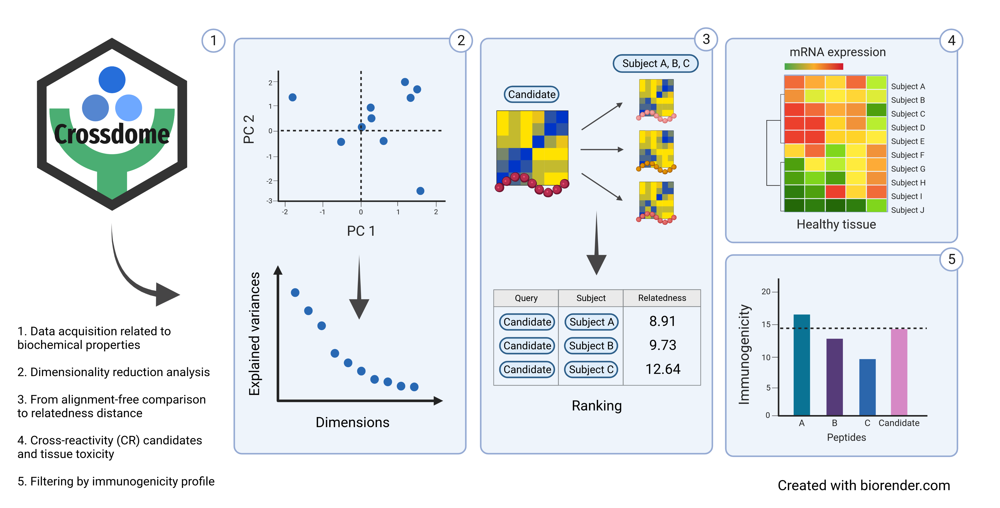

<!-- README.md is generated from README.Rmd. Please edit that file -->

# Crossdome (Beta) <a href=''></a>

<!-- badges: start -->

[](https://github.com/oandrefonseca/crossdome/actions/workflows/R-CMD-check.yaml)
[](https://app.codecov.io/gh/oandrefonseca/crossdome?branch=main)
[]()
[]()

<!-- badges: end -->

**Developed by:** André Fonseca, PhD
<a href='mailto:oandrefonseca@gmail.com'></a>

<br> <br>

## Installation

``` r

devtools::install_github("antuneslab/crossdome")
```

## Abstract

**Crossdome: An R package to measure cross-reactivity risk on the
sequence-space**

<p align="justify">
Currently, several clinical protocols are leveraging on distinct immune
mechanisms, such as adoptive T-cell therapy and peptide-based vaccines.
However, multiple factors can impact the accuracy of these immune-based
applications, such as expression heterogeneity, immunogenicity, and
cross-reactivity (CR) risk. Crossdome was created to measure
cross-reactivity potential based on biochemical properties. Our approach
aims to rank potential CR candidates and measure cross-reactivity risk
using mRNA expression, immunogenicity score (TCR binding), and MHC
presentation probability. Additionally, we provide the expression
profile related to each CR candidate.
</p>

<a href=''></a>

<p align="justify">
<b>Figure 1. Crossdome workflow and strategy.</b>Crossdome summarises
biochemical properties per amino acid into 12 principal components. In
turn, the principal components are used to convert peptide sequences
into biochemical profiles (matrices). Next, given a target peptide,
Crossdome screens an immunopeptidomics dataset for a similar biochemical
profiler, i.e., CR candidates. A relatedness score between the target
and candidate off-targets is calculated based on linear distance.
Finally, Crossdome incorporates expression levels and immunogenicity
predictions for each potential off-target.
</p>

## Functions and Features

#### Prediction

- **`cross_background`** Peptide database spanning eluted candidates
  (experimentally validated) and custom (user-defined).
- **`cross_pair_summary`** Calculates relatedness score between
  peptides.
- **`cross_compose`** Predicts relatedness among peptides in a given
  database. Low values are associated with cross-reactive candidates.
- **`cross_browser`** Opens an interactive shiny application.

#### Analysis

- **`cross_expression_matrix`** Extracts gene donor mRNA expression
  based on CR candidates.
- **`cross_substitution_matrix`** Calculates position-specific
  substitution across cross-reactive candidates.
- **`cross_peptide_properties`** Converts a peptide to biochemical
  profile.
- **`cross_write`** Exports Crossdome result slot for a tsv file.

#### Visualization

- **`cross_expression_plot`** A heatmap presenting the gene donor
  expression profile.
- **`cross_tissues_plot`** A bar plot summarizing the tissue-specificy
  groups.
- **`cross_prediction_plot`** Plot a dot plot showing the immunogenic
  predictions **\[UNDER CONSTRUCTION\]**.
- **`cross_pairwise_plot`** Correlation plot based on two peptide /
  biochemical profiles **\[UNDER CONSTRUCTION\]**.
- **`cross_substitution_plot`** A heatmap combined with seqlogo
  displaying amino acid substitutions.

## Included datasets

- **`hla_database`** Immunopeptidomics spanning several MHC Class I
  alleles. Includes binding affinity, and immunogenicity score from [MHC
  Flurry](https://www.sciencedirect.com/science/article/pii/S2405471220302398)
  and
  [DeepImmuno](https://academic.oup.com/bib/article/22/6/bbab160/6261914),
  respectively.
- **`hpa_database`** Expression database derived from [Human Protein
  Atlas](https://www.proteinatlas.org/).
- **`peptide_annotation`** Database for mapping peptides to gene-donors
  derived from [NCBI RefSeq
  Protein](https://www.ncbi.nlm.nih.gov/refseq/) **\[UNDER
  CONSTRUCTION\]**.
- **`mage_off_targets`** Curated off-targets related to MAGEA3-specific
  TCR.

To inspect the data sets use: `data(DATA_NAME)`

## Basic Usage

``` r

library(crossdome)

database <- cross_background(off_targets = 'ESDPIVAQY', allele = "HLA-A*01:01")
result <- cross_compose(query = 'EVDPIGHLY', background = database)
#> ##------ Wed Jan 11 17:19:21 2023 ------##
```

<table>
<thead>
<tr>
<th style="text-align:right;">
rank
</th>
<th style="text-align:left;">
query
</th>
<th style="text-align:left;">
subject
</th>
<th style="text-align:right;">
n_positive
</th>
<th style="text-align:right;">
n_mismatch
</th>
<th style="text-align:right;">
relatedness_score
</th>
<th style="text-align:right;">
pvalue
</th>
<th style="text-align:left;">
hla_allele
</th>
</tr>
</thead>
<tbody>
<tr>
<td style="text-align:right;">
1
</td>
<td style="text-align:left;">
EVDPIGHLY
</td>
<td style="text-align:left;">
EVDPIGHLY
</td>
<td style="text-align:right;">
9
</td>
<td style="text-align:right;">
0
</td>
<td style="text-align:right;">
0.00
</td>
<td style="text-align:right;">
0.0000000
</td>
<td style="text-align:left;">
HLA-A01:01
</td>
</tr>
<tr>
<td style="text-align:right;">
2
</td>
<td style="text-align:left;">
EVDPIGHLY
</td>
<td style="text-align:left;">
EVDPIGHVY
</td>
<td style="text-align:right;">
9
</td>
<td style="text-align:right;">
1
</td>
<td style="text-align:right;">
1.35
</td>
<td style="text-align:right;">
0.0000001
</td>
<td style="text-align:left;">
HLA-A01:01
</td>
</tr>
<tr>
<td style="text-align:right;">
3
</td>
<td style="text-align:left;">
EVDPIGHLY
</td>
<td style="text-align:left;">
EADPTGHSY
</td>
<td style="text-align:right;">
6
</td>
<td style="text-align:right;">
3
</td>
<td style="text-align:right;">
8.72
</td>
<td style="text-align:right;">
0.0000336
</td>
<td style="text-align:left;">
HLA-A01:01
</td>
</tr>
<tr>
<td style="text-align:right;">
4
</td>
<td style="text-align:left;">
EVDPIGHLY
</td>
<td style="text-align:left;">
EVDPTSHSY
</td>
<td style="text-align:right;">
6
</td>
<td style="text-align:right;">
3
</td>
<td style="text-align:right;">
10.43
</td>
<td style="text-align:right;">
0.0001107
</td>
<td style="text-align:left;">
HLA-A01:01
</td>
</tr>
<tr>
<td style="text-align:right;">
5
</td>
<td style="text-align:left;">
EVDPIGHLY
</td>
<td style="text-align:left;">
VSDPVGVLY
</td>
<td style="text-align:right;">
6
</td>
<td style="text-align:right;">
4
</td>
<td style="text-align:right;">
10.95
</td>
<td style="text-align:right;">
0.0001567
</td>
<td style="text-align:left;">
HLA-A01:01
</td>
</tr>
<tr>
<td style="text-align:right;">
6
</td>
<td style="text-align:left;">
EVDPIGHLY
</td>
<td style="text-align:left;">
EMDPVTQLY
</td>
<td style="text-align:right;">
8
</td>
<td style="text-align:right;">
4
</td>
<td style="text-align:right;">
11.23
</td>
<td style="text-align:right;">
0.0001889
</td>
<td style="text-align:left;">
HLA-A01:01
</td>
</tr>
<tr>
<td style="text-align:right;">
7
</td>
<td style="text-align:left;">
EVDPIGHLY
</td>
<td style="text-align:left;">
YTDPVGVLY
</td>
<td style="text-align:right;">
6
</td>
<td style="text-align:right;">
4
</td>
<td style="text-align:right;">
11.53
</td>
<td style="text-align:right;">
0.0002293
</td>
<td style="text-align:left;">
HLA-A01:01
</td>
</tr>
<tr>
<td style="text-align:right;">
8
</td>
<td style="text-align:left;">
EVDPIGHLY
</td>
<td style="text-align:left;">
EHDPVGQMV
</td>
<td style="text-align:right;">
7
</td>
<td style="text-align:right;">
5
</td>
<td style="text-align:right;">
11.69
</td>
<td style="text-align:right;">
0.0002542
</td>
<td style="text-align:left;">
HLA-A01:01
</td>
</tr>
<tr>
<td style="text-align:right;">
9
</td>
<td style="text-align:left;">
EVDPIGHLY
</td>
<td style="text-align:left;">
ESDPEGALW
</td>
<td style="text-align:right;">
6
</td>
<td style="text-align:right;">
4
</td>
<td style="text-align:right;">
12.72
</td>
<td style="text-align:right;">
0.0004821
</td>
<td style="text-align:left;">
HLA-A01:01
</td>
</tr>
<tr>
<td style="text-align:right;">
10
</td>
<td style="text-align:left;">
EVDPIGHLY
</td>
<td style="text-align:left;">
EVAPAGASY
</td>
<td style="text-align:right;">
5
</td>
<td style="text-align:right;">
4
</td>
<td style="text-align:right;">
12.95
</td>
<td style="text-align:right;">
0.0005563
</td>
<td style="text-align:left;">
HLA-A01:01
</td>
</tr>
<tr>
<td style="text-align:right;">
11
</td>
<td style="text-align:left;">
EVDPIGHLY
</td>
<td style="text-align:left;">
NVDPVQHTY
</td>
<td style="text-align:right;">
6
</td>
<td style="text-align:right;">
4
</td>
<td style="text-align:right;">
12.97
</td>
<td style="text-align:right;">
0.0005612
</td>
<td style="text-align:left;">
HLA-A01:01
</td>
</tr>
<tr>
<td style="text-align:right;">
12
</td>
<td style="text-align:left;">
EVDPIGHLY
</td>
<td style="text-align:left;">
DSDPTGTAY
</td>
<td style="text-align:right;">
5
</td>
<td style="text-align:right;">
5
</td>
<td style="text-align:right;">
13.04
</td>
<td style="text-align:right;">
0.0005853
</td>
<td style="text-align:left;">
HLA-A01:01
</td>
</tr>
<tr>
<td style="text-align:right;">
13
</td>
<td style="text-align:left;">
EVDPIGHLY
</td>
<td style="text-align:left;">
DVSPLMHLF
</td>
<td style="text-align:right;">
7
</td>
<td style="text-align:right;">
5
</td>
<td style="text-align:right;">
13.49
</td>
<td style="text-align:right;">
0.0007682
</td>
<td style="text-align:left;">
HLA-A01:01
</td>
</tr>
<tr>
<td style="text-align:right;">
14
</td>
<td style="text-align:left;">
EVDPIGHLY
</td>
<td style="text-align:left;">
QIDPVLQVY
</td>
<td style="text-align:right;">
8
</td>
<td style="text-align:right;">
6
</td>
<td style="text-align:right;">
13.55
</td>
<td style="text-align:right;">
0.0007944
</td>
<td style="text-align:left;">
HLA-A01:01
</td>
</tr>
<tr>
<td style="text-align:right;">
15
</td>
<td style="text-align:left;">
EVDPIGHLY
</td>
<td style="text-align:left;">
SLDPLAMLY
</td>
<td style="text-align:right;">
6
</td>
<td style="text-align:right;">
5
</td>
<td style="text-align:right;">
13.58
</td>
<td style="text-align:right;">
0.0008085
</td>
<td style="text-align:left;">
HLA-A01:01
</td>
</tr>
<tr>
<td style="text-align:right;">
16
</td>
<td style="text-align:left;">
EVDPIGHLY
</td>
<td style="text-align:left;">
SVDPHGFIS
</td>
<td style="text-align:right;">
5
</td>
<td style="text-align:right;">
5
</td>
<td style="text-align:right;">
13.60
</td>
<td style="text-align:right;">
0.0008169
</td>
<td style="text-align:left;">
HLA-A01:01
</td>
</tr>
<tr>
<td style="text-align:right;">
17
</td>
<td style="text-align:left;">
EVDPIGHLY
</td>
<td style="text-align:left;">
LLDPIKELY
</td>
<td style="text-align:right;">
6
</td>
<td style="text-align:right;">
4
</td>
<td style="text-align:right;">
13.66
</td>
<td style="text-align:right;">
0.0008489
</td>
<td style="text-align:left;">
HLA-A01:01
</td>
</tr>
<tr>
<td style="text-align:right;">
18
</td>
<td style="text-align:left;">
EVDPIGHLY
</td>
<td style="text-align:left;">
FVEPVGLNY
</td>
<td style="text-align:right;">
6
</td>
<td style="text-align:right;">
5
</td>
<td style="text-align:right;">
13.75
</td>
<td style="text-align:right;">
0.0008957
</td>
<td style="text-align:left;">
HLA-A01:01
</td>
</tr>
<tr>
<td style="text-align:right;">
19
</td>
<td style="text-align:left;">
EVDPIGHLY
</td>
<td style="text-align:left;">
FVNPISFVY
</td>
<td style="text-align:right;">
6
</td>
<td style="text-align:right;">
5
</td>
<td style="text-align:right;">
13.88
</td>
<td style="text-align:right;">
0.0009614
</td>
<td style="text-align:left;">
HLA-A01:01
</td>
</tr>
<tr>
<td style="text-align:right;">
20
</td>
<td style="text-align:left;">
EVDPIGHLY
</td>
<td style="text-align:left;">
KFDPVGEIL
</td>
<td style="text-align:right;">
6
</td>
<td style="text-align:right;">
6
</td>
<td style="text-align:right;">
14.04
</td>
<td style="text-align:right;">
0.0010592
</td>
<td style="text-align:left;">
HLA-A01:01
</td>
</tr>
<tr>
<td style="text-align:right;">
21
</td>
<td style="text-align:left;">
EVDPIGHLY
</td>
<td style="text-align:left;">
AVDPIKDMY
</td>
<td style="text-align:right;">
6
</td>
<td style="text-align:right;">
4
</td>
<td style="text-align:right;">
14.06
</td>
<td style="text-align:right;">
0.0010678
</td>
<td style="text-align:left;">
HLA-A01:01
</td>
</tr>
<tr>
<td style="text-align:right;">
22
</td>
<td style="text-align:left;">
EVDPIGHLY
</td>
<td style="text-align:left;">
FLEPLGLAY
</td>
<td style="text-align:right;">
6
</td>
<td style="text-align:right;">
6
</td>
<td style="text-align:right;">
14.08
</td>
<td style="text-align:right;">
0.0010839
</td>
<td style="text-align:left;">
HLA-A01:01
</td>
</tr>
<tr>
<td style="text-align:right;">
23
</td>
<td style="text-align:left;">
EVDPIGHLY
</td>
<td style="text-align:left;">
QLDPIYVAY
</td>
<td style="text-align:right;">
6
</td>
<td style="text-align:right;">
5
</td>
<td style="text-align:right;">
14.15
</td>
<td style="text-align:right;">
0.0011284
</td>
<td style="text-align:left;">
HLA-A01:01
</td>
</tr>
<tr>
<td style="text-align:right;">
24
</td>
<td style="text-align:left;">
EVDPIGHLY
</td>
<td style="text-align:left;">
ELDPNNAVY
</td>
<td style="text-align:right;">
6
</td>
<td style="text-align:right;">
5
</td>
<td style="text-align:right;">
14.18
</td>
<td style="text-align:right;">
0.0011473
</td>
<td style="text-align:left;">
HLA-A01:01
</td>
</tr>
<tr>
<td style="text-align:right;">
25
</td>
<td style="text-align:left;">
EVDPIGHLY
</td>
<td style="text-align:left;">
YVDSEGHLY
</td>
<td style="text-align:right;">
6
</td>
<td style="text-align:right;">
3
</td>
<td style="text-align:right;">
14.20
</td>
<td style="text-align:right;">
0.0011600
</td>
<td style="text-align:left;">
HLA-A01:01
</td>
</tr>
<tr>
<td style="text-align:right;">
26
</td>
<td style="text-align:left;">
EVDPIGHLY
</td>
<td style="text-align:left;">
IISPVGDAY
</td>
<td style="text-align:right;">
5
</td>
<td style="text-align:right;">
6
</td>
<td style="text-align:right;">
14.37
</td>
<td style="text-align:right;">
0.0012774
</td>
<td style="text-align:left;">
HLA-A01:01
</td>
</tr>
<tr>
<td style="text-align:right;">
27
</td>
<td style="text-align:left;">
EVDPIGHLY
</td>
<td style="text-align:left;">
ESDPIVAQY
</td>
<td style="text-align:right;">
5
</td>
<td style="text-align:right;">
4
</td>
<td style="text-align:right;">
14.38
</td>
<td style="text-align:right;">
0.0012840
</td>
<td style="text-align:left;">
HLA-A01:01
</td>
</tr>
<tr>
<td style="text-align:right;">
28
</td>
<td style="text-align:left;">
EVDPIGHLY
</td>
<td style="text-align:left;">
NIDPITMAY
</td>
<td style="text-align:right;">
5
</td>
<td style="text-align:right;">
5
</td>
<td style="text-align:right;">
14.38
</td>
<td style="text-align:right;">
0.0012849
</td>
<td style="text-align:left;">
HLA-A01:01
</td>
</tr>
<tr>
<td style="text-align:right;">
29
</td>
<td style="text-align:left;">
EVDPIGHLY
</td>
<td style="text-align:left;">
QVDPLSALK
</td>
<td style="text-align:right;">
6
</td>
<td style="text-align:right;">
5
</td>
<td style="text-align:right;">
14.46
</td>
<td style="text-align:right;">
0.0013432
</td>
<td style="text-align:left;">
HLA-A01:01
</td>
</tr>
<tr>
<td style="text-align:right;">
30
</td>
<td style="text-align:left;">
EVDPIGHLY
</td>
<td style="text-align:left;">
KWDPTGHIL
</td>
<td style="text-align:right;">
6
</td>
<td style="text-align:right;">
5
</td>
<td style="text-align:right;">
14.47
</td>
<td style="text-align:right;">
0.0013482
</td>
<td style="text-align:left;">
HLA-A01:01
</td>
</tr>
</tbody>
</table>

``` r

str(result)
#> Formal class 'xrResult' [package "crossdome"] with 7 slots
#>   ..@ query          : chr "EVDPIGHLY"
#>   ..@ result         :'data.frame':  37656 obs. of  10 variables:
#>   .. ..$ rank             : int [1:37656] 1 2 3 4 5 6 7 8 9 10 ...
#>   .. ..$ query            : chr [1:37656] "EVDPIGHLY" "EVDPIGHLY" "EVDPIGHLY" "EVDPIGHLY" ...
#>   .. ..$ subject          : chr [1:37656] "EVDPIGHLY" "EVDPIGHVY" "EADPTGHSY" "EVDPTSHSY" ...
#>   .. ..$ n_positive       : int [1:37656] 9 9 6 6 6 8 6 7 6 5 ...
#>   .. ..$ n_mismatch       : int [1:37656] 0 1 3 3 4 4 4 5 4 4 ...
#>   .. ..$ relatedness_score: num [1:37656] 0 1.35 8.72 10.43 10.95 ...
#>   .. ..$ zscore           : num [1:37656] -5.48 -5.25 -3.99 -3.69 -3.6 ...
#>   .. ..$ pvalue           : num [1:37656] 2.12e-08 7.66e-08 3.36e-05 1.11e-04 1.57e-04 ...
#>   .. ..$ hla_allele       : chr [1:37656] "HLA-A*01:01" "HLA-A*01:01" "HLA-A*01:01" "HLA-A*01:01" ...
#>   .. ..$ percentile_rank  : num [1:37656] 0 0.00266 0.00531 0.00797 0.01062 ...
#>   ..@ allele         : chr "HLA-A*01:01"
#>   ..@ expression     : list()
#>   ..@ analysis       : list()
#>   ..@ position_weight: num [1:9] 1 1 1 1 1 1 1 1 1
#>   ..@ timestamp      : chr "##------ Wed Jan 11 17:19:21 2023 ------##"
```
